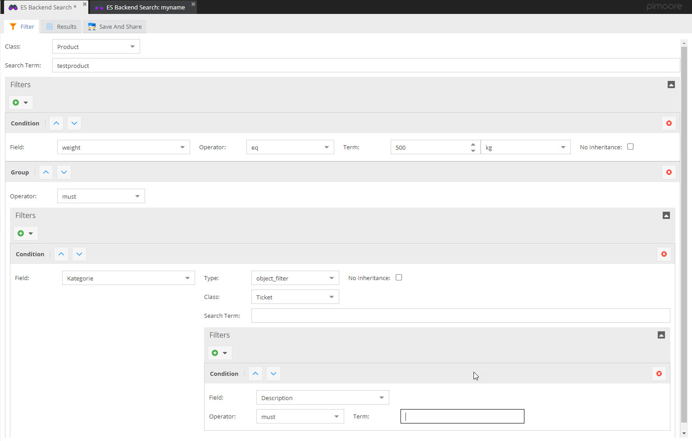

# Advanced Object Search via Elasticsearch

Advanced Object Search bundle provides advanced object search in 
Pimcore backend powered by Elasticsearch. 

## Integration into Pimcore

### Installation and Configuration
- During installation, all tables and the configuration file in `app/config/pimcore/advancedobjectsearch` are created. 
- Before starting, the configuration file has to be set up correctly: 
  - add Elasticsearch host(s)
  - configure index prefix

### GUI
GUI for creating searches against ES index with
- saving functionality
- sharing functionality




### Plugin Hooks
Following event listeners are called automatically
- `pimcore.dataobject.postUpdate` - data object is updated in ES index, all child objects are added to update queue.
- `pimcore.dataobject.preDelete`  - data object is deleted from ES index.
- `pimcore.class.postUpdate`  - ES index mapping is updated or index recreated if necessary.

### Pimcore Console
Functions in Pimcore console.
- `advanced-object-search:process-update-queue` --> processes whole update queue of es search index.
- `advanced-object-search:re-index` --> Reindex all data objects of given class. Does not delete index first or resets update queue.
- `advanced-object-search:update-mapping` --> Deletes and recreates mapping of given classes. Resets update queue for given class.

For details see documentation directly in Pimcore console.


### Pimcore Maintenance
With every Pimcore maintenance call, 500 entries of update queue are processed.


## API Methods

### Create Mapping for data object classes

Per data object class one index with one document type is created.
```php
<?php
/**
* @var \AdvancedObjectSearchBundle\Service $service
 */
$service = $this->get("bundle.advanced_object_search.service");
$service->updateMapping(ClassDefinition::getByName("Product"));
```


### Update index data

On data object save or via script:
```php
<?php
/**
* @var \AdvancedObjectSearchBundle\Service $service
 */
$service = $this->get("bundle.advanced_object_search.service");

$objects = Product::getList();
foreach($objects as $object) {
    $service->doUpdateIndexData($object);
}

```

### Search/Filter for data

```php
<?php
/**
* @var \AdvancedObjectSearchBundle\Service $service
 */
$service = $this->get("bundle.advanced_object_search.service");

//filter for relations via ID
$results = $service->doFilter(3,
    [
        new FilterEntry(
            "objects",
            [
                "type" => "object",
                "id" => 75
            ],
            BoolQuery::SHOULD
        )
    ],
    ""
);


//filter for relations via sub query
$results = $service->doFilter(3,
    [
        [
            "fieldname" => "objects",
            "filterEntryData" => [
                "type" => "object",
                "className" => "Customer",
                "filters" => [
                    [
                        "fieldname" => "firstname",
                        "filterEntryData" => "tom"
                    ]
                ]
            ]
        ],

    ],
    ""
);


// full text search query without filters
$results = $service->doFilter(3,
    [],
    "sony"
);


// filter for several attributes - e.g. number field, input, localized fields
$results = $service->doFilter(3,
    [
        [
            "fieldname" => "price",
            "filterEntryData" => 50.77
        ],
            "fieldname" => "price2",
            "filterEntryData" => [
                "gte" => 50.77,
                "lte" => 50.77
            ]
        ],
        [
            "fieldname" => "keywords",
            "filterEntryData" => "test2",
            "operator" => BoolQuery::SHOULD
        ],
        [
            "fieldname" => "localizedfields",
            "filterEntryData" => [
                "en" => [
                    "locname" => "englname"
                ]
            ]
        ],
        [
            "fieldname" => "localizedfields",
            "filterEntryData" => [
            "de" => [
                "locname" => "deutname"
            ]
        ],
        new FilterEntry("keywords", "testx", BoolQuery::SHOULD)
    ],
    ""
);

```


## Not Supported Data Types
Currently following data types are not supported - but can be added if needed in future versions: 
- ClassificationStore
- Slider
- Password
- Block
- Table
- StructuredTable
- Geographic data types
- Image data types
- CalculatedValue
